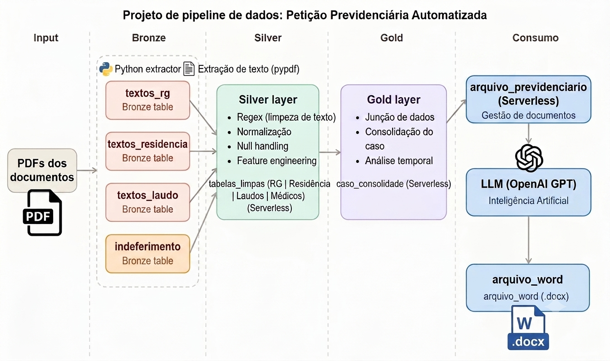

# Pipeline de Geração Automática de Petições Previdenciárias


---

## Objetivo

Automatizar o processamento de documentos previdenciários: extração de informações relevantes, consolidação estruturada dos dados e geração automática de petição inicial utilizando um modelo de linguagem (LLM).

O fluxo recebe documentos reais do cliente (RG, comprovante de residência, laudo médico, carta de indeferimento do INSS) e entrega uma petição estruturada em `.docx`, pronta para revisão do advogado.

---

## Resultado Final

O arquivo [`peticao_joao_da_silva.docx`](./peticao_joao_da_silva.docx) na raiz do repositório é o output gerado pelo pipeline para o cliente fictício João da Silva, utilizando a petição da cliente Maria como referência de estrutura e fundamentação jurídica.

> **Importante:** o fluxo não realiza simples substituição de nomes. O prompt foi construído para que o LLM gere uma fundamentação adequada à profissão e ao diagnóstico específico de João da Silva, distinguindo-se do caso da Maria.

---

## Arquitetura

O pipeline foi baseado na **arquitetura Medallion** (Bronze → Silver → Gold), aplicada a documentos jurídicos:





---

## Estrutura do Repositório

```
pipeline_peticoes_previdenciarias/
│
├── configs/
│   └── documentos.json                              # Padrões Regex centralizados por tipo de documento
│
├── files/                                           # Documentos de entrada (PDFs fictícios do cliente)
│
├── images/
│   └── pipeline_diagram.png                        # Diagrama visual do pipeline
│
├── notebooks/
│   ├── 01-bronze/
│   │   └── pdf_to_br_documentos                    # Extração do texto bruto dos PDFs (Bronze)
│   ├── 02-silver/
│   │   ├── br_sl_indeferimento                     # Extração dos dados da carta de indeferimento
│   │   ├── br_sl_laudo                             # Extração dos dados do laudo médico
│   │   ├── br_sl_residencia                        # Extração dos dados do comprovante de residência
│   │   └── br_sl_rg                                # Extração dos dados do RG
│   ├── 03-gold/
│   │   └── sl_gl_caso_previdenciario               # Consolidação de todos os dados (Gold)
│   └── peticao                                     # Geração da petição via LLM
│
├── output/
│   └── peticao_joao_da_silva.docx                  # Petição final gerada pelo pipeline
│
├── prompts/
│   └── peticao_auxilio_acidente.txt                # Prompt utilizado na chamada ao LLM
│
├── template/
│   └── Peticao_MODELO_Auxilio_Doenca_Maria_da_Silva_2026-06-22.docx   # Modelo de referência
│
└── README.md
```

## Ferramentas Utilizadas
 
| Ferramenta | Papel no pipeline |
|---|---|
| **Databricks Community Edition** | Ambiente de desenvolvimento e execução dos notebooks |
| **Apache Spark / PySpark** | Processamento e transformação dos dados entre camadas |
| **pdfplumber** | Extração de texto dos documentos PDF |
| **Regex** | Extração estruturada das informações por tipo de documento |
| **OpenAI GPT** | Geração da petição a partir dos dados estruturados |
| **python-docx** | Exportação do resultado final em formato `.docx` |
 
> **Nota sobre a API OpenAI:** a integração foi implementada e o prompt está disponível na pasta `prompts/`. A execução não foi realizada neste ambiente por ausência de créditos disponíveis, mas toda a estrutura de chamada está pronta para ser executada com uma chave válida.
 
---
 
## Como Executar
 
### Pré-requisitos
 
- Conta no [Databricks Community Edition](https://community.cloud.databricks.com/)
- Chave de API da OpenAI (para o notebook de geração da petição)
- Cluster Databricks com Python 3.10+ e as bibliotecas abaixo instaladas:
```
pdfplumber
openai
python-docx
```
 
### Configuração
 
1. Faça o upload dos arquivos da pasta `files/` para o DBFS (ex.: `dbfs:/FileStore/peticoes/joao/`)
2. Ajuste os caminhos nos notebooks conforme o destino escolhido
3. Insira sua chave da OpenAI no notebook `peticao` ou configure como secret no Databricks
### Execução
 
Configure um **Databricks Workflow** seguindo a ordem abaixo, ou execute manualmente nessa sequência:
 
```
01-bronze/pdf_to_br_documentos
        ↓
02-silver/br_sl_indeferimento   (paralelo)
02-silver/br_sl_laudo           (paralelo)
02-silver/br_sl_residencia      (paralelo)
02-silver/br_sl_rg              (paralelo)
        ↓
03-gold/sl_gl_caso_previdenciario
        ↓
peticao
```
 
O arquivo `.docx` será salvo na pasta `output/` ao final da execução.
 
---
 
## Raciocínio da Solução
 
A primeira alternativa considerada foi enviar todos os documentos diretamente ao LLM. Essa abordagem foi descartada pelos seguintes motivos:
 
- maior consumo de tokens e custo por requisição
- menor previsibilidade e rastreabilidade da resposta
- dificuldade de auditoria dos dados utilizados
- reprocessamento desnecessário a cada nova chamada
A solução adotada separa processamento de dados de geração de texto. O LLM recebe apenas um JSON estruturado com as informações consolidadas — não os documentos brutos — o que reduz o volume enviado e aumenta a consistência da saída.
 
Essa arquitetura também facilita futuras trocas de modelo (GPT → Claude → Gemini) sem alteração no pipeline de dados.
 
---
 
## O que Funcionou Bem
 
- A separação em camadas Medallion tornou o pipeline fácil de depurar e auditar
- Centralizar os Regex em `documentos.json` simplificou a manutenção e a adição de novos tipos de documento
- A tabela Gold consolidada funcionou bem como contrato entre o pipeline de dados e o LLM
- A geração do `.docx` com python-docx entregou um resultado diretamente utilizável pelo escritório
---
 
## Dificuldades Encontradas
 
**Relacionamento entre documentos:** nem todos os documentos continham um identificador único (como CPF). Foi necessário criar uma estratégia de join baseada nos dados comuns disponíveis em cada documento antes de consolidar a camada Gold.
 
**Variações de layout nos PDFs:** pequenas diferenças na formatação exigiram a criação de expressões regulares mais robustas, que cobrem múltiplos formatos possíveis para um mesmo campo.
 
---
 
## Melhorias Futuras
 
Com mais tempo, as seguintes melhorias podem ser implementadas:
 
- **OCR especializado** para documentos digitalizados ou de baixa qualidade
- **Validação automática** dos dados extraídos (CPF, datas, CID)
- **Document AI** (Google Document AI ou AWS Textract) para substituir Regex em campos de maior variabilidade
- **Testes automatizados** para os padrões Regex, garantindo cobertura de diferentes layouts
- **Versionamento de prompts**, mantendo histórico das versões utilizadas para geração das petições
- **Monitoramento do Workflow** com alertas em caso de falha por etapa
- **Interface web simples** para upload dos documentos e download da petição gerada, sem necessidade de acesso ao Databricks
---
 
## Considerações Finais
 
A solução priorizou rastreabilidade e separação de responsabilidades. O pipeline produz uma camada estruturada que pode alimentar qualquer modelo de IA futuramente, sem precisar reprocessar os documentos originais.
 
Essa abordagem torna a solução mais escalável, auditável e de fácil manutenção — características importantes para um escritório que processará múltiplos casos com volumes crescentes de documentos.